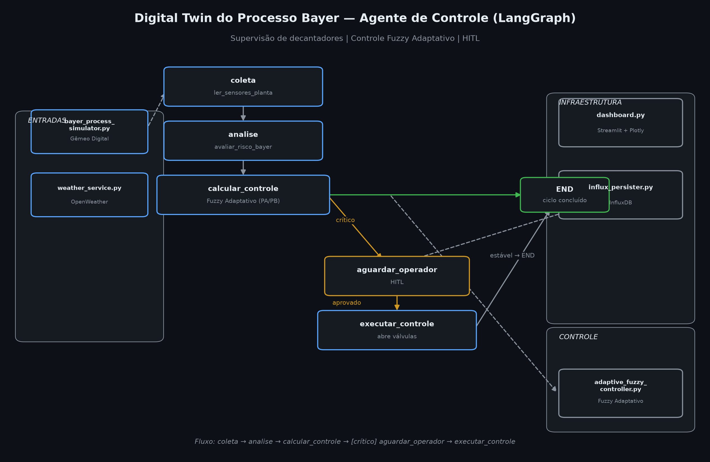
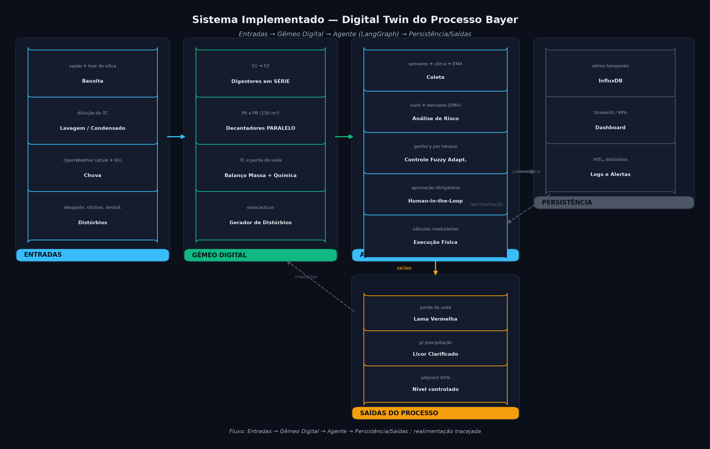

# Manual de Execução

## Sistema de Controle Preditivo — Digital Twin do Processo Bayer

**Versão:** 1.0 · **Projeto:** `projeto_bayer/` · **Data:** agosto/2026

Este manual descreve, passo a passo, como **instalar**, **configurar** e **executar** o
ambiente de supervisão e controle do processo de produção de alumina (Processo Bayer),
composto por um **Gêmeo Digital** multicapacidade, um **controlador Fuzzy Adaptativo** e
um **agente orquestrado por LangGraph** com intervenção humana obrigatória (HITL).

---

## 1. Visão Geral

O sistema simula a etapa crítica de **controle de nível de decantadores** para evitar
transbordamentos, especialmente sob chuva intensa. Ele integra:

- **Simulação física** dos tanques (série e paralelo) com balanço de volume e química.
- **Controlador Fuzzy Adaptativo** para abertura modulante das válvulas de drenagem.
- **Previsão meteorológica** em tempo real (OpenWeather).
- **Human-in-the-Loop (HITL)** — ações críticas só executam após aprovação do operador.
- **Persistência** em série temporal (InfluxDB) e **dashboard** interativo (Streamlit).

### Arquitetura



**Fluxo do agente:** `coleta → analise → calcular_controle → [crítico] aguardar_operador → executar_controle`.
Quando o nível (filtrado por EMA) supera o limite crítico sob chuva, o fluxo **interrompe** aguardando aprovação do operador antes de agir fisicamente nas válvulas.

### Visão de sistema (versão implementada)



A descrição completa dos componentes, a comparação com o modelo conceitual e as métricas de
validação estão em **[docs/SISTEMA_IMPLEMENTADO.md](docs/SISTEMA_IMPLEMENTADO.md)**.

---

## 2. Requisitos

- **Windows** (o ambiente foi desenvolvido e validado em Windows) — os comandos abaixo são
  para **PowerShell**.
- **Python 3.10 ou superior**.
- **Git** (opcional, para clonar/versionar).
- Opcionais por funcionalidade:

| Funcionalidade | Dependência extra |
|---|---|
| Chuva real | Conta gratuita no [OpenWeatherMap](https://openweathermap.org/api) |
| Persistência de série temporal | InfluxDB 2.x (local ou via Docker) |
| Dashboard | Pacotes `streamlit`, `plotly`, `pandas` (já em `requirements.txt`) |

O **núcleo** (simulador + controladores + agente + testes) roda e é validado **sem** os
serviços opcionais — eles degradam com segurança quando indisponíveis.

---

## 3. Instalação

### 3.1 Obter o código

```powershell
cd C:\Users\lugos\Documents\Agente_Bayer
# (ou clone do repositório)
git clone https://github.com/LuisGSVasconcelos/bayer-digital-twin.git
cd bayer-digital-twin
```

### 3.2 Criar o ambiente virtual e instalar dependências

```powershell
python -m venv .venv
.\.venv\Scripts\Activate.ps1
python -m pip install --upgrade pip
pip install -r requirements.txt
```

> Se preferir `uv` (mais rápido), o equivalente é:
> ```powershell
> uv venv .venv --seed
> uv pip install --python .venv\Scripts\python.exe -r requirements.txt
> ```

---

## 4. Configuração (serviços opcionais)

Se quiser chuva real e persistência, crie o arquivo `.env` a partir do modelo:

```powershell
Copy-Item .env.example .env
```

Preencha com sua chave e token:

```dotenv
# OpenWeatherMap
OPENWEATHER_API_KEY=sua_chave_aqui
OPENWEATHER_LAT=-23.5505
OPENWEATHER_LON=-46.6333
OPENWEATHER_UNITS=metric
OPENWEATHER_LANG=pt_br

# InfluxDB
INFLUXDB_URL=http://localhost:8086
INFLUXDB_TOKEN=seu_token
INFLUXDB_ORG=minha_planta
INFLUXDB_BUCKET=processo_bayer
```

Sem esse arquivo ou sem as credenciais, o sistema roda normalmente usando clima padrão
("sem chuva") e sem persistência — útil para desenvolvimento e testes offline.

---

## 5. Execução

Todas as etapas abaixo assumem o ambiente ativado (item 3.2).

### 5.1 Rodar os testes automatizados

```powershell
pytest -v
```

Esperado: **23 testes aprovados** cobrindo controlador fuzzy, controlador adaptativo,
simulador físico e fluxo do agente (HITL), incluindo a correção do domínio do erro.

### 5.2 Benchmark comparativo (Padrão vs Adaptativo)

Cria métrica **reproduzível** (seeds fixas, 10 repetições, média ± desvio-padrão):

```powershell
python test_adaptive_controller.py
```

Saída esperada (valores de referência):

```
Fuzzy Padrão:     RMSE 8.14% ± 0.00
Fuzzy Adaptativo: RMSE 7.81% ± 0.00
Melhoria: +4.1%
```

### 5.3 Executar o agente em modo texto (terminal)

Executa ciclos de supervisão e, quando detecta risco crítico, **pausa pedindo aprovação**:

```powershell
python langgraph_agent.py
```

Em caso de alerta, o console pergunta `Autorizar abertura emergencial das válvulas? (s/n)`.
Digite `s` para liberar a ação ou `n` para abortar.

### 5.4 Dashboard interativo (Streamlit)

```powershell
streamlit run dashboard.py
```

Abra no navegador: **http://localhost:8501**

No painel:
- clique **Iniciar** para rodar a simulação e **Parar** para pausar;
- ajuste a **velocidade** (ciclos/s) — a simulação roda acelerada (vários ciclos/tick);
- no seletor **Cenário de clima**, force chuva fixa (**Forte/Moderada/Nenhuma**), ajuste a
  **chuva de forma contínua** com o **slider "Manual..."** (0–0,30 mm/s), ou use a **API** real;
- quando o alerta de HITL aparecer, o loop **pausa** (não congela) e abre o botão
  **✅ Aprovar Ação Emergencial** no painel **HITL**; clique-o para liberar a válvula;
- no painel **🌩️ Distúrbios**, **ligue/desligue** cada distúrbio (variação de alimentação,
  desgaste da bomba, atrito da válvula, desbalanceamento PA/PB, diluição de TC, sílica e picos
  de sensor) — **todos ficam ativos por padrão**, mas você pode desativar os que quiser;
- no painel **🕹️ Válvula de saída (manual)**, marque **"Atuação manual da válvula"** para
  **definir a abertura PA/PB manualmente** (sliders 0–100%), sobrepondo o controle PI — útil
  para testar a resposta do nível a um comando manual (desligue p/ voltar ao automático);
- acompanhe KPIs (níveis, TC, perda de soda) e gráficos (PV × SP × MV, química, distúrbios).

**Comportamento do controle:** o agente atua como **regulador PI bidirecional**: quando o nível
fica **acima** do setpoint (**65%**) abre a válvula de **drenagem**; quando fica **abaixo**, abre
a **água de reposição (makeup)**, que injeta fluxo e repõe o nível. Isso **corrige** o problema
do atuador só-drenagem (que não conseguia levantar o nível) — o setpoint é **sustentado mesmo
sem chuva**. A modulação é **suave** (bandas proporcionais + integrais por sentido, com
anti-windup), sem oscilar 0–100%.
O **HITL** gateia apenas a **emergência** (nível **>80%** ou **>70% com tendência de alta** +
chuva): nessa condição o loop **pausa** (gráficos/log param — espera correta) e mostra o botão
**Aprovar**. Ao aprovar (uma vez), o controle traz o nível de volta ao setpoint e o **segura**.

**Balanço do decantador:** corrigido para que a **chuva e a alimentação afetem o nível** — o
licor clarificado sai apenas o licor **separado** (sem a chuva); a chuva **acumula** no
decantador e eleva o nível. O controle então **abre a válvula proporcionalmente à chuva** para
manter os 65%. O balanço também **conserva a caustica** (a soda que sai no licor clarificado é
abatida da massa), de modo que o **TC estabiliza** perto do valor de entrada, com uma perda
química de sílica **realista** (pequena).

> **Nota (makeup × nível):** o controle é **bidirecional** — acima do setpoint usa a drenagem,
> abaixo usa a **água de reposição (makeup)**, que injeta volume e **sustenta o nível mesmo sem
> chuva**. Por isso o setpoint é mantido em qualquer condição de chuva (Forte, Moderada,
> Nenhuma ou Manual). O makeup aparece no gráfico de controle como linha verde (MV).

**Cenário de demonstração:** o dashboard abre com os decantadores **acima do limiar (≈80,5%)**
— o HITL dispara já no primeiro ciclo (botão Aprovar disponível). Ao aprovar, a ação é
**travada**: a válvula continua drenando **sem re-pedir aprovação a cada ciclo** até o nível
sair do estado crítico, chegando ao setpoint (**~65%**) e se mantendo lá (a válvula mantém uma
abertura para compensar a chuva). O demo ativa apenas os **distúrbios de química** (sílica e
diluição de TC), de modo que a **perda de soda e o TC variam** com a alimentação constante —
que, por sua vez, mantém o **nível estável no setpoint**. O conjunto completo de distúrbios
fica ativo no benchmark (`test_adaptive_controller.py`) e no simulador. A simulação roda leve
(~60 ms/tick) e os **spikes de sensor são desabilitados** no demo.

---

## 6. Estrutura de Arquivos

```
projeto_bayer/
├── bayer_process_simulator.py   # Gêmeo Digital (tanques, decantadores, distúrbios)
├── fuzzy_controller.py          # Controlador Fuzzy base (Mamdani + centroide)
├── adaptive_fuzzy_controller.py # Fuzzy com ganho adaptativo (gradiente + momentum)
├── weather_service.py           # Integração OpenWeather (opcional)
├── langgraph_agent.py           # Agente LangGraph + HITL
├── influx_persister.py          # Persistência InfluxDB (opcional)
├── dashboard.py                 # Dashboard Streamlit + Plotly
├── test_adaptive_controller.py  # Benchmark reproduzível
├── tests/                       # Suíte pytest (23 testes)
├── docs/
│   └── SISTEMA_IMPLEMENTADO.md  # Visão completa do sistema (componentes, métricas)
├── scripts/
│   ├── diagrama_arquitetura.py  # Gera o diagrama do fluxo (PNG dark-mode)
│   └── diagrama_sistema_implementado.py  # Gera o diagrama em subgrafos (PNG dark-mode)
├── assets/
│   ├── arquitetura_processo_bayer.png
│   └── arquitetura_sistema_implementado.png
├── requirements.txt
├── .env.example                 # Modelo de configuração de serviços
└── MANUAL_EXECUCAO.md           # Este documento
```

---

## 7. Solução de Problemas (Troubleshooting)

| Sintoma | Provável causa | Solução |
|---|---|---|
| `pytest` não encontrado | Ambiente não ativado / deps ausentes | Ative o venv e rode `pip install -r requirements.txt` |
| Erro ao importar `influxdb_client` | Pacote não instalado | `pip install influxdb-client` (opcional; sem ele a persistência vira no-op) |
| Clima sempre "sem chuva" / "indisponível" | Sem chave OpenWeather ou sem `.env` | Preencha `OPENWEATHER_API_KEY` no `.env` |
| Dashboard não inicia | `streamlit`/`plotly` ausentes, ou porta em uso | `pip install streamlit plotly pandas`; troque a porta com `--server.port 8502` |
| Branch `master` vs `main` | Inicialização Git | Envie com `git push -u origin main` |
| Autenticação GitHub pedindo senha | Token ausente | Usar Windows Credential Manager ou token classic com escopo `repo` |

### Regenerar o diagrama de arquitetura

```powershell
python scripts\diagrama_arquitetura.py
```

---

## 8. Referência Rápida de Comandos

```powershell
# instalação
python -m venv .venv
.\.venv\Scripts\Activate.ps1
pip install -r requirements.txt

# configuração (opcional)
Copy-Item .env.example .env

# validação
pytest -v
python test_adaptive_controller.py

# aplicação
streamlit run dashboard.py          # dashboard web
python langgraph_agent.py           # agente em modo texto (HITL interativo)
```

---

*Documento gerado como artefato do projeto `projeto_bayer` — Processo Bayer (alumina).*