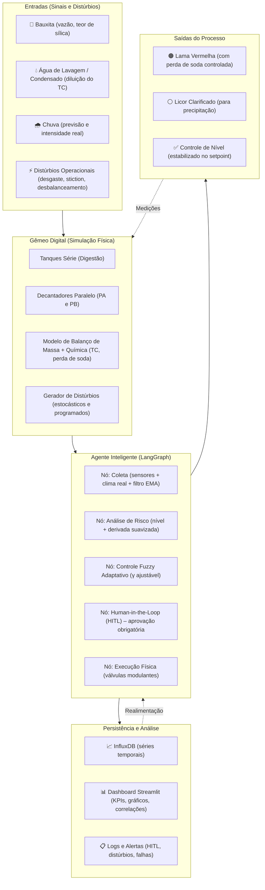

# Sistema Implementado — Visão Completa

> Documento de referência do sistema *real* construído em `projeto_bayer`.
> Complementa o diagrama conceitual com a visão operacional, os componentes e as
> decisões de engenharia da implementação.

---

## 1. Diagrama do Sistema (versão implementada)



---

## 2. Componentes

### 2.1 Entradas (INPUTS)

| Entrada | Como é modelada | Fonte |
| :--- | :--- | :--- |
| **Bauxita** | Vazão mássica (22 L/s base) com **variação estocástica** (distúrbio de alimentação) e **teor de sílica** (0–15%) que afeta a perda química de soda. | Simulador + Gerador de Distúrbios |
| **Água de lavagem / Condensado** | Injetada como **diluição do Teor Cáustico (TC)** quando o TC ultrapassa 200 g/L. Vazão de diluição (0–12 L/s) é um **distúrbio hidráulico** a jusante. | Gerador de Distúrbios (baseado no TC medido) |
| **Chuva** | Intensidade em mm/h, **em tempo real da API OpenWeather** (atual + previsão de 6 h). Conversão para L/s sobre a área exposta dos decantadores (150 m²). | `weather_service` |
| **Distúrbios operacionais** | Desgaste de bomba, stiction de válvula, desbalanceamento PA/PB, picos de sensor. Configuráveis e ativados por opção. | `GeradorDisturbios` |

### 2.2 Gêmeo Digital (DIGITAL_TWIN)

Modelo **fenomenológico**, não caixa-preta:

- **Balanço de massa** por tanque (entrada − saída = acumulação).
- **Balanço de soda** (Teor Cáustico) e **perda de soda** (mecânica + química) nos decantadores.
- **Topologia realista**: digestores em série, decantadores em paralelo.
- **Válvula de drenagem** conta no balanço de volume do decantador (MV tem efeito real no nível).
- **Distúrbios** injetados a cada ciclo.

> **Nota de fidedignidade:** o simulador **não possui termo de evaporação**. As saídas dos
> decantadores são licor clarificado, lama (com perda de soda) e a vazão de drenagem da
> válvula modulante.

### 2.3 Agente Inteligente (AGENTE — LangGraph)

Grafo de estados com cinco nós por ciclo:

| Nó | O que faz | Diferencial |
| :--- | :--- | :--- |
| **Coleta** | Lê os níveis (com **filtro EMA**), consulta a API de clima, aplica picos de sensor (distúrbio) e envia ao InfluxDB. | Filtro EMA + clima real. |
| **Análise de Risco** | Criticidade se nível ultrapassa 70% **com tendência > 1%/s** ou 80% absoluto — **no nível filtrado por EMA**. | Derivada suavizada evita falsos alarmes (o limiar usa EMA, não o bruto com spike). |
| **Controle Fuzzy Adaptativo** | Calcula abertura (0–100%) com Fuzzy + **ganho γ adaptativo** (gradiente + momentum). **Um controlador por decantador.** | Ganho aprende a minimizar o erro em tempo real; independente por PA/PB. |
| **Human‑in‑the‑Loop** | Se crítico, o grafo **pausa** e exige aprovação manual antes de agir na válvula. | Segurança (analogia API 2350). |
| **Execução Física** | Aplica a abertura recomendada (após aprovação), atualizando a **MV**. | Válvulas **modulantes** (não on/off). |

### 2.4 Persistência e Análise (PERSISTENCIA)

- **InfluxDB** — séries temporais por ciclo: PV (nível), SP, MV, TC, perda de soda, chuva, sílica, ganho γ.
- **Dashboard Streamlit** — KPIs em tempo real, gráficos de evolução, correlações, **painel de aprovação HITL**.
- **Logs e alertas** — eventos (distúrbios, alertas, aprovações) para rastreabilidade.

### 2.5 Saídas (SAIDAS)

- **Nível controlado** no setpoint (65%) — com a métrica real do benchmark (ver §4).
- **Perda de soda monitorada** (mecânica + química) e passível de minimização via diluição.
- **Alertas antecipados** (chuva forte, sílica alta, TC crítico).
- **Rastreabilidade completa** para auditoria e compliance.

---

## 3. Comparação — Modelo Conceitual vs. Sistema Implementado

| Aspecto | Modelo Conceitual Original | Sistema Implementado |
| :--- | :--- | :--- |
| Atualização | Previsão em horizonte fixo | **Contínua** (a cada ciclo) + previsão meteorológica de 6 h |
| Modelo | Não especificado (caixa‑preta) | **Fenomenológico** (balanços de massa e química) + distúrbios |
| Ação de controle | Ajuste de saídas | **Abertura de válvulas modulantes** com feedback de erro e derivada |
| Adaptabilidade | Estática | **Ganho adaptativo γ** que aprende com o erro |
| Intervenção humana | Não mencionada | **HITL obrigatório** para ações críticas |
| Distúrbios | Implícitos | **7 tipos** modelados explicitamente |
| Persistência | Não mencionada | **InfluxDB** + **Dashboard** |
| Integração com clima | Não | **OpenWeather** (atual + previsão) |
| Validação | Teórica | **Benchmark reproduzível** (fuzzy vs. adaptativo), **23 testes** |

---

## 4. Métricas de validação (reais, reproduzíveis)

```
Fuzzy Padrão:     RMSE 8.14% ± 0.00   (10 runs, seeds fixas 42–51)
Fuzzy Adaptativo: RMSE 7.81% ± 0.00
Melhoria: +4.1%
Suíte de testes: 23 aprovados
```

> A métrica `<2%` não é suportada pela validação do projeto — os valores acima são os
> obtidos e reproduzíveis.

---

## 5. Próximos Passos (evoluções)

- **Otimização Econômica** — custo da perda de soda e da abertura de válvulas para controle econômico.
- **Multi‑agentes** — um agente LangGraph por decantador, com coordenação central.
- **Integração com ERP** — métricas de produção (alumina produzida, soda consumida).
- **Ingestão de documentos (Docling)** para calibração do Gêmeo com dados reais do processo.
- **Controle Preditivo (MPC)** — substituição/adição ao Fuzzy (listado como evolução).